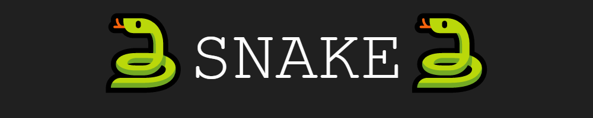
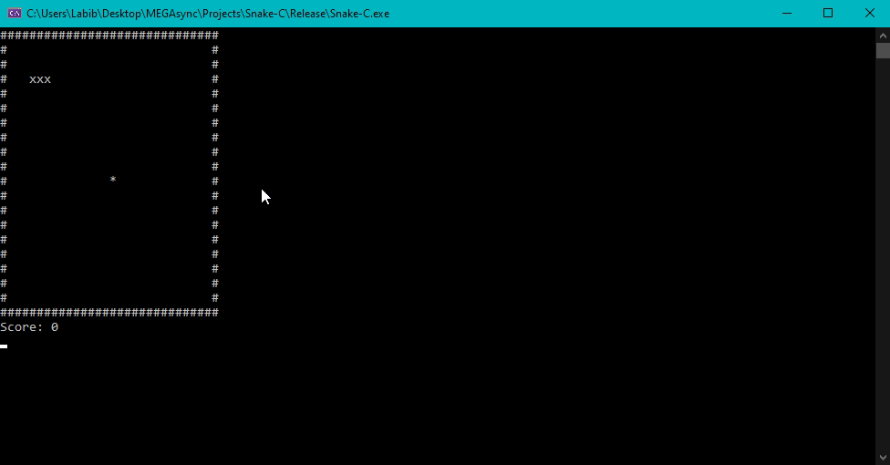

## What This Is
This is my personal snake game that I made using C and Visual Studio. The game can be downloaded and played in the terminal. This is one of my first C projects, so it is made quite simple and easy to play. The game itself implemented many of the basic C concepts such as structs, enums, loops, etc.

## Installation
Please clone the repo or download the zip. Go into the release directory and launch the snake-c.exe to play!

## How to Play
- Use **W A S D** keys to move
- Use **Q** to quit the game
- Eat the fruit indicated by the * to gain points
- Score 10 points to win
- You lose if you bite your own tail

## How the game works
The main libraries needed for this game to work

The main game loop that runs:

An array stores information about the game board inside an array. This array has boarders made with stars (*) and the inside is filled with space charecters '_'. The game loop goes through various functions for different components of the game:
- Input is responsible for gathering the user input asynchronously
- updateSnake is responsible for updating the position of the snake on the board based on the direction it is facing
- render draws the board onto the terminal or console
- logic calculates whether the game as ended (winner, loser) and updates the state of the game
- sleep is used to controll the speed of the game/snake (bad implementation but it is a quick solution)
- system('cls') is used to clear the board making it ready for the next render
